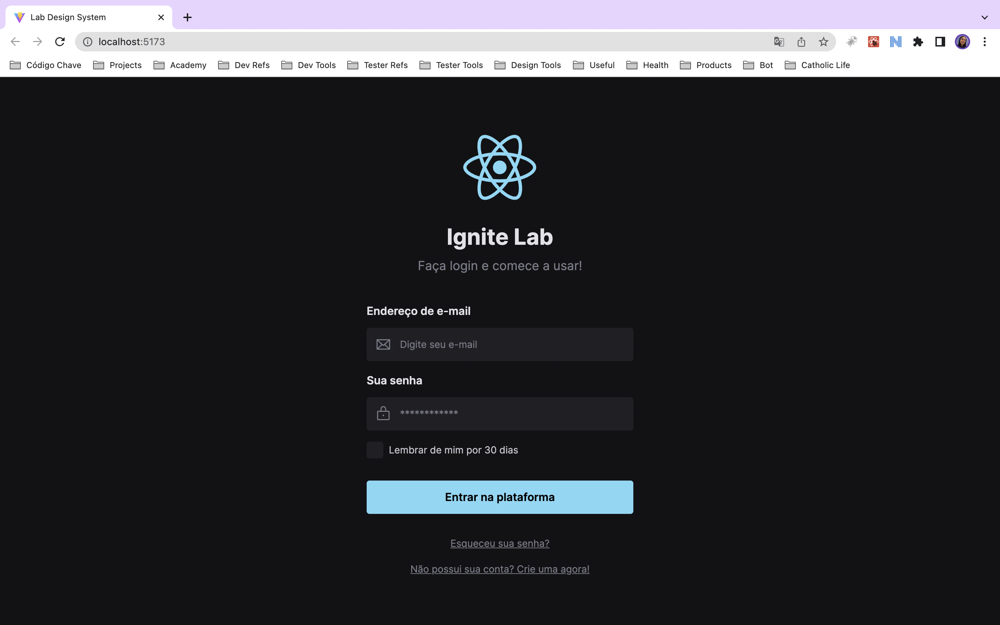

# Lab Design System

This is a design system developed on Ignite Lab with the [Rocketseat Education](https://www.rocketseat.com.br/). The purpose of this project was to create a login interface from a Figma design system. In this lab I learned to use Figma and document the web project with Storybook. You can see the Storybook [here](https://gihoekveld.github.io/lab-design-system/).

## Technologies used ☕️ 🐍 ⚛️

- ReactJS
- Typescript
- TailwindCSS
- Storybook

## Screenshots

### Login page



## Installation 💻

Clone the repository

```bash
git clone
cd lab-design-system
npm install
```

## Usage

To run the project, use the following command:

```bash
npm run dev
```

Project status 🚧

The project is still in development. 
